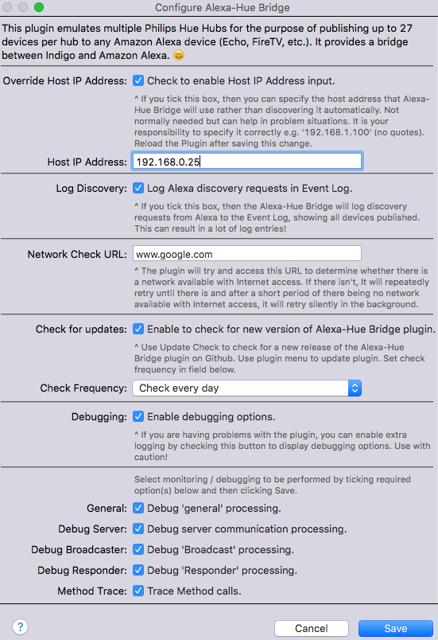
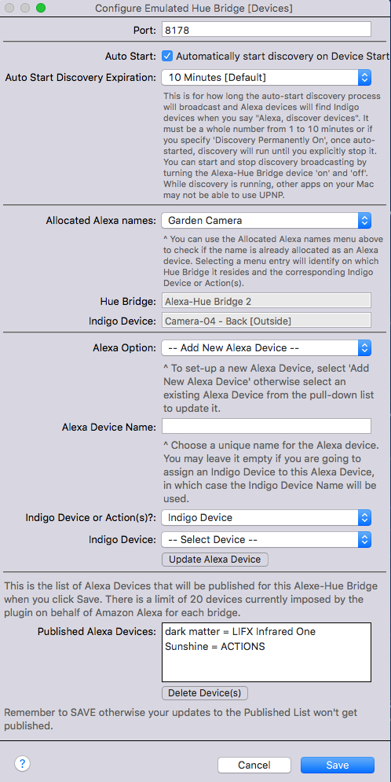

Alexa-Hue Bridge V3
===================

V3.x of this plugin emulates multiple Philips Hue bridges to publish Indigo devices (on/off and dimmer types only) to any Amazon Alexa device (Echo, Dot, FireTV, etc.).

The 3.x and higher versions of this plugin require Indigo V7.0+.
Use the latest 1.x release for Indigo 6.

There is a 27 device limit for each emulated Hue Bridge which is a limitation in Amazon's Alexa implementation. By supporting more than one emulated Hue Bridge this limit is now effectively bypassed.

Version 3 adds the ability to directly control Indigo Actions in addition to Indigo Devices.

Consider using a [Device Group](http://wiki.indigodomo.com/doku.php?id=indigo_7_documentation:virtual_devices_interface#device_groups) in the [Virtual Devices interface](http://wiki.indigodomo.com/doku.php?id=indigo_7_documentation:virtual_devices_interface) to group devices that you generally control together into a single device and publish that. This is a good way to create “scenes” that you can turn on/off rather than control each device individually.

If you want to control devices that aren't relay (on/off) or dimmer devices natively, use the new Actions feature to achieve that. Alternatively, you can also use [Virtual On/Off devices](http://wiki.indigodomo.com/doku.php?id=indigo_7_documentation:virtual_devices_interface#virtual_on_off_devices) to control devices that aren't relay (on/off) or dimmer devices natively but this will limit you to just on and off commands.

Version 3 records Alexa Devices as properties in the associated Alexa-Hue Bridge whereas Version 2 recorded this detail in each Indigo Device that was controlled by Alexa. This change was required in order to be able to support Actions and is largley transparent to the User.
This means that you can now have multiple Alexa Devices referring to the same Indigo Device or set of Actions e.g 'dining room lamp', 'dining light' can refer to the same Indigo device. Unlike Version 2, in Version 3 this can be done within one Alexa-Hue Bridge.

This plugin is **not intended to be an officially supported** Alexa integration, but rather as a stop-gap until Indigo Domotics can evaluate how best to officially support Alexa devices. See our [blog post on the subject](http://www.indigodomo.com/blog/2015/10/28/amazon-echo-and-indigo/) and the Terms section below for more information.

Install
-------

The plugin is quite straight-forward: the first thing you’ll want to do is install it. Download the version you want from the releases section above (we always recommend the most recent release but you can go back to previous releases if you want to). Once downloaded, double-click the plugin file in the Finder on your Indigo Server Mac. This will install and enable the plugin.

Migration from Version 2
------------------------

On the initial install there will be no Version 3 definitions for any of the V2 Alexa Devices previously known to an Alexa-Hue Bridge device. You will need to do an Edit Device Settings for each Alexa-Hue Bridge. When you do this, there will be a short delay while the plugin scans Indigo devices for V2 definitions associated with the Alexa-Hue Bridge you are editing. It will convert each Version 2 definition it discovers to Version 3 and output a message to the Indigo Event Log. When the Edit Device Settings displays, review the list of Published Devices and **very important do a Save**. Repeat this for each Alexa-Hue Bridge.

Now the next important part, use the iOS Alexa App to forget all devices and then do a discovery which is best done by asking Alexa to 'Discover Devices'. If all goes to plan your devices will be discovered and your V2 definitions will have been converted to V3.

 * **Background Information Note:**

    In Version 2 of this plugin, Alexa used the id of the Indigo Device as a unique key for each device it knew about. It used this key when sending a message to Indigo to turn on/off or dim a device. On receipt of the message, Version 2 of this plugin used this key to operate the approriate Indigo Device.

    As Version 3 now supports Actions, this method wouldn't work. Internally, Version 3 now uses a 64 character sha-256 hash key to uniquely identify each Alexa Device. This is then associated with the Indigo Device or Indigo Actions as defined by the user via Edit Device Settings.

This is a non-destructive migration: This means that if you want to revert to Version 2, you can. Just install Version 2 of the plugin and it should work as before.

Plugin Configuration
--------------------

There are five configuration options for the plugin:

* **Override Host IP Address**

    If you tick this box, then you can specify the host address of the Apple Mac that the Alexa-Hue Bridge plugin is running on (rather than the plugin discovering it automatically). This is not normally needed but can help in problem situations.

    When this is ticked, it reveals the field to enter the Host IP Address into. It is your responsibility to specify it correctly e.g. '192.168.1.100' (no quotes). Reload the Plugin after saving this change.

* **Log Discovery**

    If you tick this box, then the Alexa-Hue Bridge will log discovery requests from Alexa to the Event Log, showing all devices published. This can result in a lot of log entries! So now you can see what discovered devices are being sent to Alexa

    Note: see the Discovery section later for a description of how this works.

* **Network Check**

    The plugin will try and access this URL to determine whether there is a network available with Internet access. If there isn't, It will repeatedly retry until there is and after a short period of there being no network available with Internet access, it will retry silently in the background.

    * **Note:**
    
        If there is no network available, the plugin can't work and so there is no point in the plugin proceeding until the network becomes available.

* **Update Check**

    Use Update Check to check for a new release of the Alexa-Hue Bridge plugin on Github. Use the plugin menu (see later) to update plugin.
    Check tick box to enable checks for updates and select frequency (daily or weekly).

* **Debugging**

    This is not normally required but may be helpful to resolve any error situations.

    When this is ticked, it reveals further debugging options.

    These further options help control the amount of debugging information that’s shown in the Event Log window. This information will help track down any issues that you may experience using the plugin. We recommend only turning on debugging if you’re asked to by someone trying to help with a specific issue. Some of the debugging options are particularly chatty and will spew a lot of information so that one should really only be enabled when specifically asked.

Managing Devices
----------------

Create an emulated Hue Bridge by creating a new Indigo device:

New... \> Type: Alexa-Hue Bridge, Model: Emulated Hue Bridge

### Configuring the Emulated Hue Bridge

See the ** Migration from Version 2 ** section above for a description of Version 2 -> Version 3 migration. 

* **Port**

    Default is Auto or specify a port. Normally leave as *Auto* and the plugin will select a port starting from *8178*. Once a port had been allocated the device properties will be updated with the allocated value and the port will assigned as the device's address.

* **Auto Start**

    Tick this check box to automatically start discovery on Device start. If not ticked, diiscovery will be off. 

* **Expiration in minutes**

    This is for how long the auto-start discovery process will broadcast and Alexa devices will find Indigo devices when you say "Alexa, discover devices". It must be a whole number from 1 to 10 minutes or if you specify 'Discovery Permanently On', once auto-started, discovery will run until you explicitly stop it. You can start and stop discovery broadcasting by turning the Alexa-Hue Bridge device 'on' and 'off'. While discovery is running, other apps on your Mac may not be able to use UPNP. See later section for further detail on discovery.

* **Allocated Alexa Names**

    The Assigned Alexa names menu can be used to check if the name is already assigned as an Alexa device.

    This is a list of all the Alexa names defined across all the Alexa_hue Bridge devices. These are shown in alphabetical order and are used to check for duplicate names which will be rejected if spotted (as Alexa doesn't like duplicate names!). Select the Alexa name to get further details. This will indicate which Alexa-Hue Bridge the Alexa Device is assigned to. In addition it will either show the associated Indigo device (see image above) or associated Indigo Actions, e.g.:

    

* **Alexa Option**

    To add a new Alexa Device select *-- Add New Alexa Device --* or select an existing Alexa Device from the list to update it.

* **New Alexa Device Name**

    If adding a new Alexa Device, enter the name that you want Alexa to respond to. If you are going to associate this new Alexa Device with an Indigo Device, you can leave the field blank and the plugin will use the Indigo device name as the Alexa name. Otherwise, if you are going to associate this new Alexa Device with Indigo Actions you have to provide a name. The name field is not allowed to contain a vertical bar character ('|'). You are not allowed to define duplicate Alexa Names (across all Alexa-Hue Bridges) and this will will be flagged as an error

* **Alexa Device Name**

    If updating an existing Alexa Device, you can enter a revised name that you want Alexa to respond to, otherwise just leave the existing value. The field can't be empty. You are not allowed to define duplicate Alexa Names (across al Alexa-Hue Bridges) and this will will be flagged as an error.

* **Indigo Device or Action(s)?**

    Select whether you want this Alexa Device to be associated with an Indigo Device or a set of Indigo Actions.

* **Indigo Device**

    If you selected to associate an Indigo Device, select the required device from this list. If adding a new Alexa Device and the *New Alexa Device Name* is empty, the Indigo device name will be input in that field.

* **Indigo Action fields**

    

    Select the actions and variables you want associated with this Alexa Device. As a minimum, you must specify an action for **Indigo ON Action** and **Indigo OFF Action**. You can specify **NO ACTION** if you don't want the Alexa Device to support dimming. You can assign an **Indigo On/Off Action Variable** and this variable will be pre-filled with the ON/OFF value returned by Alexa prior to invoking the ON/OFF Action. The value in this variable can therefore be accessed in the ON/OFF Action. You can also assign an **Indigo Dim Action Variable** and this variable will be pre-filled with the DIM value returned by Alexa prior to invoking the DIM Action. The value in this variable can therefore be accessed in the DIM Action.

* **Add New Alexa Device / Update Alexa Device** 

    When you’re ready to add a new or update an existing Alexa Device, click either the **Add New Alexa Device** button or **Update Alexa Device** button. The device will be added into the Published Alexa Devices list (see below). If you try and add more than 27 devices you will get an error message: "You have now reached the 27 device limit imposed by Amazon Alexa for this Bridge. Create a new Alexa-Hue Bridge Device to define additional Alexa Devices."

    **Note:** You must click the *Save* button to make the changes permanent; see below.

* **Published Alexa Devices**

    This is the list of devices currently published to this Alexa Hue Bridge (including any just added or updated). There is a limit of 27 devices currently imposed by the Amazon implementation for each bridge. If an Alexa name in the list is associated with an Indigo Device and the names are different, the list will show the Alexa Device name followed by an equals sign and then the associated Indigo Device name. Otherwise if an Alexa name in the list is associated with an Indigo Actions, the list will show the Alexa Device name followed by an equals sign and then *ACTIONS*

    **Note:** This is the opposite way to how Version 2 of the plugin displayed the list.

* **Delete Devices**

    Select one or more devices from the Published Alexa Devices list and click the *Delete Device(s)* button.
    **Note:** You must click the *Save* button to make the changes permanent; see below.

* **Save**

    Once you’re finished adding/editing/deleting published devices, click the *Save* button to make the changes permanent. Click the *Cancel* button to discard all changes.

    **Note:** The **New Alexa Device Name** / **Alexa Device Name** must be empty to be able to save. This is to avoid any loss of data i.e. you have entered new or updated Alexa Device details and forgotten to do the add or update. If this occurs, you will get the following error, e.g. for a new Alexa Device:
    

Discovery
---------

At this point, the plugin knows about the devices, but Alexa doesn’t. You need to tell Alexa to discover devices. By default, you can just tell Alexa to discover your devices either by saying that or by using the Alexa app.

Saying to Alexa "Alexa discover devices" appears to be more reliable than using the Alexa App to discover devices - Your mileage may vary. :)

If you enabled *Log Discovery* in the plugin configuration, you will now see a series of messages in the Event Log. Alexa will make multiple attempts to discover devices, so you may well see the discovery for each defined Emulated Hue Hub appearing to be repeated.

An example output is like this:

<pre><code>
   Alexa-Hue Bridge                Alexa-Hue Bridge 'Test Hue Bridge Two' responding to Alexa discovery [request id: 1] ...
   Alexa-Hue Bridge                + Publishing device 'Landing Lights' to Alexa
   Alexa-Hue Bridge                ... One device discovered by Alexa on Alexa-Hue Bridge 'Test Hue Bridge Two'.
   Alexa-Hue Bridge                Alexa-Hue Bridge 'Test Hue Bridge Two' responding to Alexa discovery [request id: 2] ...
   Alexa-Hue Bridge                + Publishing device 'Landing Lights' to Alexa
   Alexa-Hue Bridge                ... One device discovered by Alexa on Alexa-Hue Bridge 'Test Hue Bridge Two'.
   Alexa-Hue Bridge                Alexa-Hue Bridge 'Test Hue Bridge One' responding to Alexa discovery [request id: 3] ...
   Alexa-Hue Bridge                + Publishing device 'Testing lamp' to Alexa
   Alexa-Hue Bridge                + Publishing device 'Virtual Camera ' to Alexa
   Alexa-Hue Bridge                + Publishing device 'boiler switch' to Alexa
   Alexa-Hue Bridge                + Publishing device 'macbook lamp' to Alexa
   Alexa-Hue Bridge                ... 4 devices discovered by Alexa on Alexa-Hue Bridge 'Test Hue Bridge One'.
   Alexa-Hue Bridge                Alexa-Hue Bridge 'Test Hue Bridge One' responding to Alexa discovery [request id: 5] ...
   Alexa-Hue Bridge                + Publishing device 'Testing lamp' to Alexa
   Alexa-Hue Bridge                + Publishing device 'Virtual Camera ' to Alexa
   Alexa-Hue Bridge                + Publishing device 'boiler switch' to Alexa
   Alexa-Hue Bridge                + Publishing device 'macbook lamp' to Alexa
   Alexa-Hue Bridge                ... 4 devices discovered by Alexa on Alexa-Hue Bridge 'Test Hue Bridge One'.
</code></pre>

In releases prior to Version 2 of the plugin, you needed to specifically start the discovery process i.e. the process in the plugin that will allow Alexa to discover devices when you tell "her" to.

This is now done automatically and it can run forever. Thanks to a comment from another Indigo user, we've added a switch which allows us to open the UPNP response port in a shared mode - so any other app that opens the same port in the same way will also work concurrently.

However, there may be other apps/plugins that don't open the port shared, and those may still require this plugin to not be in discover mode.

The **Auto Start Discovery Expiration** is defaulted to **Discovery Permanently On** which means discovery is always on. The status of discovery is shown in the state column of the Indigo device UI. A solid green dot means discovery is always on, a green timer means that it is on for a limited time (1 to 10 minutes), a grey timer means discovery is off.

Discovery can be turned on and off by using the *Turn On* and *Turn Off* controls in the UI.

Starting discovery (and stopping it) are also available as actions: As the The Alexa-Hue Bridge is defined to Indigo as a Relay device, the actions are **Turn On/Off (Light/Appliance Controls)**. So you can start (and stop if necessary) discovery from Triggers, Schedules, etc.

A quick description of how discovery works: the Hue Bridge uses a technology called UPNP to broadcast its presence and information about its devices on your local network. This broadcast is what Alexa will look for when performing its device discovery. However, UPNP may be use by other apps and plugins on your Mac (the Sonos plugin uses it also). But different processes on the same Mac can’t run their own UPNP responders unless they open them in a special way. This may be the reason you'd need to stop/start discovery yourself.

You can find out if other plugins or applications have the UPNP port open by doing the following command in a terminal window:

~~~~~~~~~~~~~~~~~~~~~~~~~~~~~~~~~~~~~~~~~~~~~~~~~~~~~~~~~~~~~~~~~~~~~~~~~~~~~~~~
sudo lsof -i :1900
~~~~~~~~~~~~~~~~~~~~~~~~~~~~~~~~~~~~~~~~~~~~~~~~~~~~~~~~~~~~~~~~~~~~~~~~~~~~~~~~

The output will show you any processes (IndigoPluginHost or or otherwise) that have the port open. In order for discovery to work, you may need to temporarily quit those apps. You can start them back up after Alexa has discovered your devices.

Controlling Devices
-------------------

That’s basically it. Once Alexa discovers your devices, you can control them with the standard Alexa commands for home automation:

-   Alexa, turn on Media Fan

-   Alexa, dim Office Wall Lamp to 50% (there is no corresponding brighten)

-   Alexa, turn Media Fan off

Alexa’s vocabulary for home automation is currently limited to turn on, turn off, and dim. We’re filtering the device list in the Manage Devices dialog to only show devices that have an on/off state, so things like thermostats and (most) sensors can’t be added. Although now largely superceded by the new Version 3 capability od=f defining actions, you can also use the [Virtual On/Off Device](http://wiki.indigodomo.com/doku.php?id=indigo_6_documentation:virtual_devices_interface#virtual_on_off_devices) type in the [Virtual Devices interface](http://wiki.indigodomo.com/doku.php?id=indigo_6_documentation:virtual_devices_interface) to create your own custom on/off devices that can do pretty much anything you want. For example, you could create a Virtual On/Off Device with an ON action group that sets a thermostat in one way, and the OFF action group would set it another. You could then “turn on” and “turn off” the group to set the thermostat.

Troubleshooting
---------------

We've created a [topic on our forums](http://forums.indigodomo.com/viewtopic.php?f=65&t=15374) for getting help with the plugin. Start by posting your question there to see if anyone can help before filing an issue here on GitHub. We're not closely monitoring the issues here but are monitoring the forums.

We've noticed that sometimes when we tapped the Discover devices button in the Alexa iOS app and it shows the progress bar, but when it's done Alexa herself says nothing on the Echo (she usually says either she didn't find or found devices). Using the voice command "Alexa, discover devices" when that happened results in an immediate reply that she couldn't and to try later. We've found that a force quit the Alexa app on the iOS device followed by started it back up and hitting the Discover devices button may get it working again.

So, there appears to be a bug with the Alexa iOS app (there are actually quite a few) that can cause discovery to fail, and once it gets into that state a force-quit restart cycle seems to clear it.

Contributing
------------

If you want to contribute, just clone the repository in your account, make your changes, and issue a pull request. Make sure that you describe the change you're making thoroughly - this will help the repository managers accept your request more quickly.

We've documented the code fairly well, so please do the same for any changes that you make. This will ensure that future contributors can effectively contribute in the future.

Terms
-----

Perceptive Automation (aka Indigo Domotics) is hosting this repository and will 
do minimal management. Unless a pull request has no description or upon cursory
observation has some obvious issue, pull requests will be accepted without any
testing by us. We may choose to delegate commit privileges to other users at
some point in the future.

We (Perceptive Automation) don't guarantee anything about this plugin - that
this plugin works or does what the description above states, so use at your own
risk. We will attempt to answer questions about the plugin but given the nature
of this plugin, which uses reverse-engineered information provided by other
users out on the net, we can’t guarantee that it will always work since either
Amazon or Philips can change the protocol at any time.

This plugin is a derivative work from a couple of different sources: the
[hueAndMe project](https://github.com/johnray/hueAndMe), which is itself based
loosely on work from the [hue-upnp project](https://github.com/sagen/hue-upnp).
We’re grateful that these developers published these projects so that we could
build upon them.

License
-------

This project is licensed using [Unlicense](http://unlicense.org/).

 Plugin ID
----------

Here's the plugin ID in case you need to programmatically restart the plugin or
start/stop discovery:

**Plugin ID**: com.indigodomo.opensource.alexa-hue-bridge

Things that are known to use the UPNP port (1900)
-------------------------------------------------

The primary issue that users experience is with port conflicts on the UPNP port
- several Mac apps open that port as part of a UPNP process. The plugin only
needs to use the port while the Alexa is discovering devices, but during that
time other apps may have a problem. This is a list of things users have found on
their Macs that use that port. It is by no means an exhaustive list.

-   The Sonos Indigo Plugin

-   The Squeezebox Indigo Plugin

-   MythTV

-   Sighthound Video

Feel free to add more, or report any other conflicts you find on [the forum
thread](http://forums.indigodomo.com/viewtopic.php?f=65&t=15374) and we'll add
it here.
